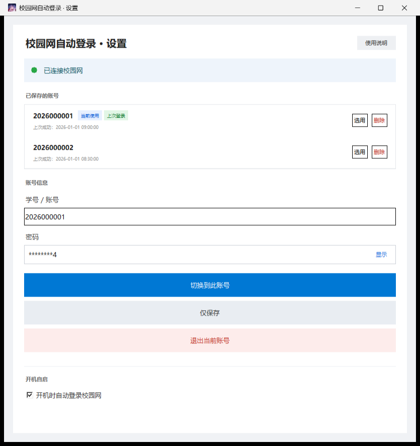
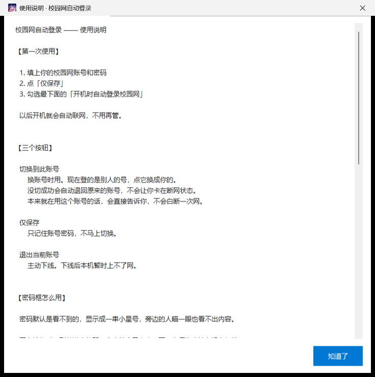

# 校园网自动登录

> 一个**单文件、免安装**的校园网自动认证工具。双击就用，拷到任何 Windows 上都能跑，
> 不需要装 Python、不需要装 VC++ 运行库、不需要装 .NET。

针对 **郑航（郑州航空工业管理学院）** 的校园网认证门户编写。其它学校需要改配置
（见下方「适配其它学校」）。


<sub>界面截图里的学号和时间都是**编造的演示数据** —— 见「项目结构」一节说明。</sub>

---

## 它做什么

- **开机自动认证**：开机自启后自动完成认证，不用再打开浏览器点登录页
- **多账号切换**：存多个学号，一键切换；切换失败会自动回滚到上一个能用的账号
- **断网自愈**：定时检测联网状态，掉线了自动重连
- **密码框隐私保护**：输入时只显示最后一位，其余打码；可点按钮临时显示全文
- **使用说明内置在程序里**：界面右上角「使用说明」按钮，不用另外找文档
- **不带走任何隐私**：exe 里不含账号密码，拷给别人是干净的

<p>

&nbsp;

</p>

## 环境要求

| 项目 | 要求 |
|---|---|
| 系统 | Windows 10 / 11（x64） |
| 运行库 | **无** —— CPython、VC++ 运行库、Tcl/Tk 全部已打包进 exe |
| 磁盘 | 约 10 MB |
| 网络 | 需要能访问校园网认证门户 |

> **首次运行会弹 SmartScreen「Windows 已保护你的电脑」**，因为 exe 没有代码签名。
> 点「更多信息」→「仍要运行」即可。这是未签名程序的正常行为，不是病毒。

## 快速开始

### 直接用

> 仓库里**不放 exe**（构建产物不入库）。请到 [Releases](../../releases) 下载
> `校园网自动登录.exe`；如果还没有 Release，就按下一节从源码自己构建一个。

拿到 exe 后双击运行，填学号和密码，点「切换到此账号」。
想开机自动登录，在设置页勾上「开机自启」。

> **exe 放在哪个文件夹都能用**，文件夹名带中文、带空格也没问题，而且它不依赖
> 同目录下的任何文件（图标、Tcl 库都在 exe 内部）。账号密码存在
> `C:\ProgramData\CampusLogin\`，**不跟着 exe 走**。
>
> 唯一的例外是**开机自启**：自启快捷方式里记的是 exe 的**绝对路径**，所以把 exe
> 挪到别处之后自启会失效。这时界面会在「开机自启」下面给出提示，
> 把那个勾**取消再重新勾一次**即可修好。

### 从源码构建

需要 Python 3.9+（能跑 PyInstaller 即可）：

```bash
pip install pyinstaller pefile
python build.py
```

`build.py` 会依次做这些事，任何一项不过就**拒绝出包**：

1. 打包成单文件 exe
2. 冒烟测试（`--selftest` 必须过；`--guitest` 只作参考，因为建 Tk 窗口在无人值守
   会话里不稳定）+ **密码框接线自检**（出现 `GUI_FAIL` 直接判失败）
3. **隐私检查**（`leak_check.py`）—— 解开 exe 的归档，确认里面没有账号密码
4. **可移植性检查**（`portability_check.py`）—— 确认运行库齐全、没有绑定本机构建路径
5. 复制到桌面交付目录

> 第 3、4 步都带**阳性对照**：先埋一个假的坏样本，确认检查真的会报警。
> 不然「检查通过」和「检查坏了」的输出一模一样，等于没查。

## 项目结构

```
campus_login.py         主程序（单文件，无参=GUI，--auto/--logout/--purge/--selftest/--guitest）
paths.py                统一的路径解析（不要在脚本里写死绝对路径）
proc_tree.py            进程树管理：Job Object + 看门狗 + _MEI 残留清理
build.py                构建入口，带四道门槛
savepoint.py            本地存档：改代码前打快照，搞砸了能回退
local_secrets.example.py  本地凭据模板（复制成 local_secrets.py 填真值，已被 gitignore）
docs/                   README 用的界面截图
```

> **README 里那几张截图是怎么来的**：跑 `python ui_shot.py` 生成，输出到 `ui_shots/`。
> 它开跑前会先 `sandbox()` —— 把数据目录换到 `%TEMP%\campus_ui_shot` 并写入假账号
> （`2026000001` 之类），所以窗口里根本没有真实学号可拍。
>
> 这一步不能省，也**不能靠事后检查**：截图里的文字是光栅化像素，把 PNG 解压出来
> 搜学号是搜不到的（连窗口标题都搜不到），那种检查只会给出假阴性。
> 只能从数据源头隔离。
>
> 想**亲眼核对** `docs/` 里那几张图（唯一可靠的验证方式），用 `png_zoom.py`
> 把可疑区域放大来看：
>
> ```bash
> python png_zoom.py docs/password-masked.png --cols 498,524,50,400   # 数字形个数
> python png_zoom.py docs/password-masked.png --crop 52,494,68,34 --scale 10
> ```
>
> 实测这两条命令能确认密码框里是「8 个星号 + 明文的 `4`」，也就是沙箱里的假密码
> `demo-1234` 露出末位 —— 而不是真实密码。

### 本地开发：别把自己的密码提交上去

```bash
cp local_secrets.example.py local_secrets.py   # 填你自己的学号 / 密码
python secret_scan.py --staged                 # 每次提交前跑一遍
```

`local_secrets.py` 已在 `.gitignore` 里，**不会**被提交、也**不会**被打进 exe。
它只供本机测试脚本用（真实登录测试、隐私检查的搜索词）。

> **密码一旦提交就删不掉了。** `git rm` 只删除后续版本，历史里仍然留着 ——
> 要清干净得改写历史 + 强制推送，而且别人已经 clone 的副本、GitHub 的缓存
> 都收不回来。所以要在**提交之前**拦，这就是 `secret_scan.py` 存在的理由。

### 改代码之前先打个存档

```bash
python savepoint.py save "改密码框之前"        # 动手前先存一份
python savepoint.py list                       # 看有哪些存档
python savepoint.py restore 2026-09-17_1329    # 搞砸了就退回去
python savepoint.py diff                       # 先看看现在跟存档差在哪
```

存档走的是**另一套引用** `refs/savepoints/*`，不是普通提交 —— 所以：

- 不污染 `git log`，不动 HEAD，不改工作区（打快照对仓库是只读的）
- **不会被 `git push --tags` 带出去**（它不是 tag），仓库要公开时这点很重要
- 一直被引用着，所以永远不会被 gc 回收
- 快照内容是那一刻工作区的完整状态（含未提交修改、新增、删除），但**遵守 .gitignore**

`restore` 之前会**自动再存一份**，所以「回退」这个动作本身也能再回退，脚本会把
反悔命令直接打在屏幕上。

> ⚠️ 脚本里**绝不调用 `git prune` / `git gc`**。本机实测：在这个工作区里跑
> `git prune`（任何形式，连默认两周宽限期的普通版也会）会把整个对象库清空，
> `git status` 报 `fatal: bad object HEAD`，连初始提交都没了。
> 清快照用 `tidy`（只删引用，不碰对象）。

### 测试与诊断脚本

| 脚本 | 作用 | 能不能当门槛 |
|---|---|---|
| `leak_check.py` | 隐私检查：exe 里有没有夹带账号密码 | ✅ 是门槛 |
| `portability_check.py` | 可移植性：换台电脑能不能跑 | ✅ 是门槛 |
| `secret_scan.py` | **提交前**扫凭据 / 本机绝对路径 | ✅ 提交前跑（`--staged`） |
| `help_check.py` | 内置使用说明确实进了 exe | 否（可以加进 build.py） |
| `wiring_gate_test.py` | 验「接线自检」这道门槛的报警链路本身通不通 | 否 |
| `verify_exe.py` | 只验不打包 | 否 |
| `pwd_test.py` | 密码框显示规则（纯函数） | 否 |
| `pwd_gui_test.py` | 密码框真实窗口绑定 | 否（要真桌面） |
| `geometry_test.py` | 9 种屏幕尺寸下窗口不超出屏幕 | 否 |
| `proc_tree_test.py` | 进程树与看门狗，含「故意复现孤儿进程」 | 否 |
| `autostart_test.py` | 开机自启的增删改查 | 否 |
| `ui_shot.py` / `layout_probe.py` | 截图 / 量布局（要真桌面） | 否 |
| `png_zoom.py` | 裁切放大 PNG 局部、数字形个数（核对截图里画了什么） | 否 |
| `savepoint.py` | 本地存档：改代码前打快照，搞砸了能整体回退 | 否（改代码前用） |

跑测试要用**带 PyInstaller 的解释器**（`leak_check` / `help_check` / `portability_check` 依赖它）。

## 适配其它学校

默认配置在 `campus_login.py` 的 `DEFAULTS` 里：

```python
DEFAULTS = {
    "portalHost": "http://202.196.169.166",   # 认证门户地址
    "wlanAcIp":   "10.0.1.10",                # AC 地址
    "wlanAcName": "ZZHK-ZAX-BRAS",            # AC 名称
    "timeoutSec": 8,
}
```

认证协议是标准的 `webauth.do` 表单提交。换学校时用浏览器 F12 抓一次登录请求，
对着改这几个值即可。也可以直接改数据目录里的 `config.json`。

> 数据目录：优先 `C:\ProgramData\CampusLogin\`，写不进去自动退回
> `%APPDATA%\CampusLogin\`。

## 已知限制

- **exe 未签名** —— 首次运行会弹 SmartScreen，见上文
- **只针对郑航门户** —— 其它学校要改配置
- **界面固定尺寸** —— 窗口会按屏幕收口，但不支持自由缩放

## 免责声明

本工具**仅供学习与个人便利使用**。使用前请确认：

1. 它是否**符合你所在学校的网络使用规定**。不少学校禁止自动化认证脚本，
   违反可能导致账号被限制。**请自行确认并承担后果。**
2. 不要用它做任何绕过计费、共享账号或攻击网络的行为。
3. 作者不对因使用本工具造成的任何后果负责。

如果你不确定学校的规定，**先去问，别先跑**。

## 许可

MIT，见 `LICENSE`。
