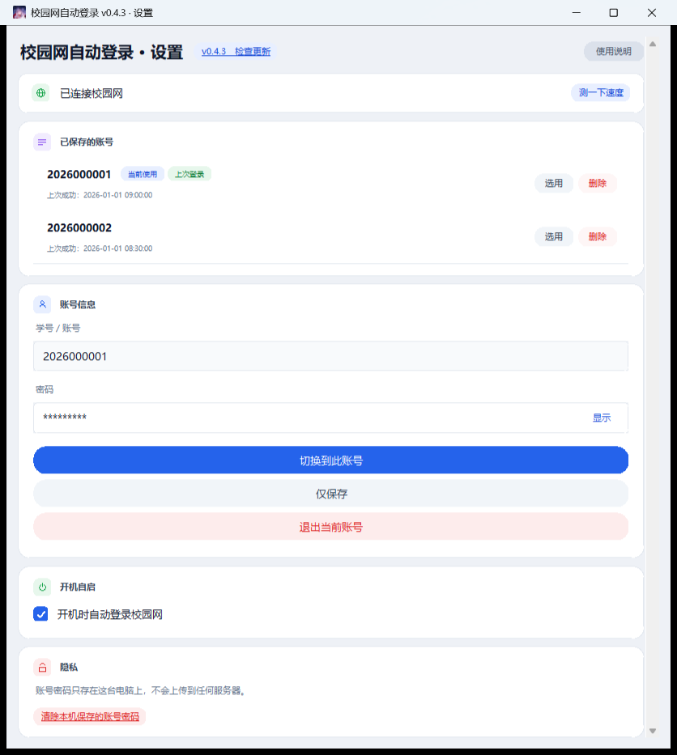

# 校园网自动登录

校园网自动登录是一个面向郑航（郑州航空工业管理学院）校园网认证门户的自动认证工具，提供开机自动认证、多账号切换、断网自愈、密码框隐私保护与内置使用说明。

> 非官方项目，与学校网络管理部门无关。请仅使用你本人有权访问的账号，并遵守学校的网络使用规定。

当前版本 0.4.1，从 [Releases](../../releases) 下载。



## 功能

- 开机自动认证，无需打开浏览器手动登录
- 多账号管理，一键切换；切换失败自动回滚到上一个可用账号
- 联网后继续守护 30 分钟，掉线自动重连；到点自动退出，不在后台常驻
- 状态栏区分「在校园网」与「能上网」：不在校园网时不会误报「已连接校园网」
- 密码框输入时只显示最后一位，可点按钮临时显示全文
- 内置检查更新，点标题栏的版本号即可升级到最新版；下载中断会自动重试，不用重头再来
- 使用说明内置于程序，无需另找文档
- 设置页可一键「清除本机保存的账号密码」，连同日志一起删掉，不用手翻系统目录
- 程序内不含账号密码，可直接分发给他人

## 运行环境

- Windows 10 / 11（x64）
- 无需安装 Python、VC++ 运行库或 .NET，依赖已全部打包进程序
- 单文件 exe，可放在任意目录运行，含中文或空格的路径均可，且不依赖同目录下的任何文件
- **不需要管理员权限**：账号数据写在 `C:\ProgramData\CampusLogin\`（该目录不可写时自动退回用户目录），
  开机自启用的是当前用户的登录计划任务，全程不要求提权，不会弹 UAC
- 磁盘占用约 12 MB

> 程序未进行代码签名，首次运行会触发 SmartScreen 提示，点击「更多信息」→「仍要运行」即可。

## 下载与使用

本站在 [hobson2233.dpdns.org](https://hobson2233.dpdns.org) 提供下载，也可以在 [Releases](../../releases) 页面下载。

双击运行，填写学号与密码，点击「切换到此账号」。需要开机自动登录时，在设置页勾选「开机自启」。

账号与配置保存在 `C:\ProgramData\CampusLogin\`，不随程序文件移动。程序自身升级时的临时文件（下载中的包、旧版本备份）也放在这个目录，**不会写到你放 exe 的地方** —— 升级完桌面（或你放 exe 的任意目录）里仍然只有 exe 本身。旧版本备份会在下次启动时自动删掉；万一那会儿删不掉（比如程序正开着），它过一会儿会自己再试几次。开机自启由系统「任务计划程序」里名为 `CampusLogin` 的任务实现（登录时触发），任务里记录程序的绝对路径，移动程序后该功能失效，取消并重新勾选即可恢复；从旧版本升级上来时界面会提示「旧设置」，同样取消再勾一次，新的守护功能才会生效。

开机联网后程序还会继续运行 30 分钟，这期间检测到掉线会自动重连，到点自行退出，不会在后台常驻。若在这 30 分钟内主动点击「退出当前账号」，程序不会自动把你登回去。

程序会检查更新：点击标题栏右侧的版本号，有新版本时可直接下载并替换自身，账号数据不受影响。

## 构建

需要 Python 3.9 及以上版本（需带 tkinter）。

```
pip install pyinstaller pefile
python build.py
```

`build.py` 依次完成打包、冒烟测试、隐私检查与可移植性检查，任一步骤未通过则不出包。

发布站点时，把构建产物交给工作区根目录的 `make_site.py` 放进 `site/`，再由 `make_manifest.py` 生成更新清单，最后用 `deploy/deploy.py` 把 `site/` 发布到 Cloudflare Worker 的静态资源上。

页面是**整份替换**的：新版本目录里没有的页面文件，线上会直接消失。但**历史安装包会保留** —— 它们归档在工作区的 `dl_archive/`，每次发布整体放进 `site/dl/`，所以站点上有一个[历史版本页](https://hobson2233.dpdns.org/history)，每个发布过的版本都能下载。安装包文件名带版本号（`dl/campus-login-0.4.1.exe`），因此可以配长缓存。

开发脚本、测试清单与排障说明见 [docs/DEVELOPMENT.md](docs/DEVELOPMENT.md)。

## 适配其它学校

**不用改源码。** 把要改的项写进数据目录里的 `config.json` 就行
（`C:\ProgramData\CampusLogin\config.json`，没有就自己建一个）：

```json
{
  "portalHost": "http://202.196.169.166",
  "wlanAcIp": "10.0.1.10",
  "wlanAcName": "ZZHK-ZAX-BRAS",
  "campusSubnets": ["10."],
  "triggerUrl": "http://1.1.1.1/",
  "loginExtra": { "pageid": "5", "templatetype": "1" }
}
```

写进去的键覆盖默认值，**没写的继续用默认**。可覆盖的项一共八个：

| `config.json` 键 | 默认值 | 含义 |
|---|---|---|
| `portalHost` | `http://202.196.169.166` | 认证门户地址 |
| `wlanAcIp` | `10.0.1.10` | AC（接入控制器）地址 |
| `wlanAcName` | `ZZHK-ZAX-BRAS` | AC 名称 |
| `timeoutSec` | `8` | 各项网络超时（秒） |
| `campusSubnets` | `["10."]` | 校园网段前缀，用来判断「在不在校园网」 |
| `triggerUrl` | `http://1.1.1.1/` | 认证成功后跳转的目标 |
| `checkTargets` | 见源码「学校参数」一节 | 连通性检测目标，`[[url, 期望正文, 名字], …]` |
| `loginExtra` | 见源码「学校参数」一节 | 门户表单的公共字段模板 |

认证协议为标准 `webauth.do` 表单提交。更换学校时用浏览器开发者工具抓一次登录请求，
把表单里的固定字段写进 `loginExtra` 即可。三个容易踩的点：

- `loginExtra` 是**浅合并** —— 只覆盖你写出来的键，其余仍用默认。所以通常只需改
  `pageid` / `templatetype` 这类真正变了的字段，不必抄全 20 个键。
- `checkTargets` 是**整体替换**（不是追加）。写成 `[]` 或类型不对会**退回默认**，
  不会把程序变成「永远测不出网」。
- 写入的值类型不对、或者写成空串 / 空表，一律**退回默认**而不是让程序失灵。
  这一条有回归测试盯着（`repo/school_profile_test.py`，43 项含阳性对照）。

## 隐私与数据

**账号密码不会上传到任何服务器。** 这句话具体到可以自己核对的程度：

- 账号、密码与登录记录只写在**本机** `C:\ProgramData\CampusLogin\`（该目录不可写时回退到 `%APPDATA%\CampusLogin\`）。所以把 exe 拷给别人，不会带出你的账号。
- 程序对外只访问两类地址：学校的认证门户（见下方 `DEFAULTS` 里的 `portalHost`）和更新发布站 `hobson2233.dpdns.org`。没有统计、上报、崩溃收集或任何第三方接口。
- 上面两条不必只凭信任：**代码是开源的**，在源码里搜 `urlopen` 或 `http`，就能看到全部对外请求。所有目标地址都集中在 `campus_login.py` 顶部的「学校参数」一节（门户、AC、连通性检测目标、认证后跳转），既没有拼接出来的隐藏地址，也不从网络下发；想换学校时改的正是同一处默认值（或用上节的 `config.json` 覆盖）。

想在本机清掉账号数据，两种方式都行：

- 设置页最下面的「清除本机保存的账号密码」；
- 命令行 `校园网自动登录.exe --purge`（退出码 0 = 清干净了）。

两者做的是同一件事：删掉 `config.json`、`accounts.json`、`last-result.json` 和 `campus-login.log`，**不可恢复**。数据目录本身会留下（里面已经空了，下次运行照常重建）。清除后需要重新输入账号密码；如果开机自启还开着，建议一并取消 —— 否则开机时会跑一次但登不上。

README 截图中的学号与密码为演示数据。

## 致谢与第三方项目

- [Python](https://www.python.org/)：运行时，随程序一同分发；PSF License。
- [Tcl/Tk](https://www.tcl.tk/)：界面库，随程序一同分发；BSD-style License。
- [PyInstaller](https://github.com/pyinstaller/pyinstaller)：将程序打包为单文件可执行程序；GPL-2.0-or-later，含允许打包专有程序的例外条款。

上述项目及其代码继续遵循各自的许可证，本项目的 MIT License 不替代其许可证。

## 免责声明

本项目按现状提供，不对可用性、准确性或使用结果作任何保证。部分学校禁止自动化认证脚本，使用前请自行确认，使用风险由使用者自行承担。

## 许可证

本项目采用 [MIT License](LICENSE)。
